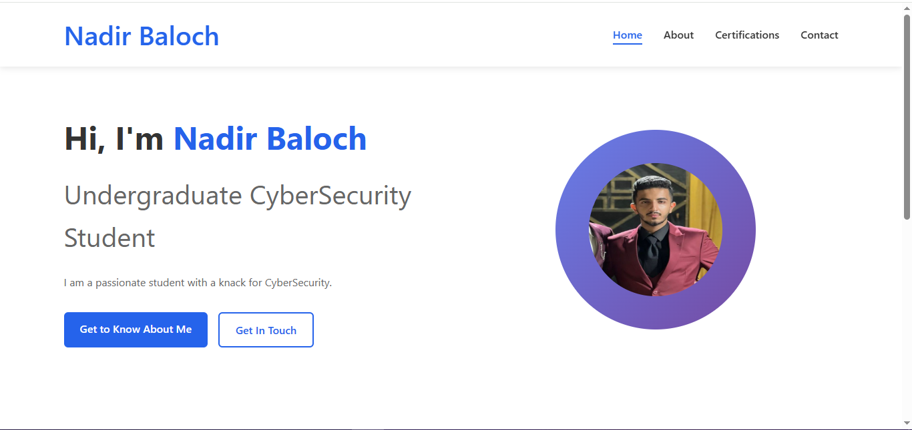
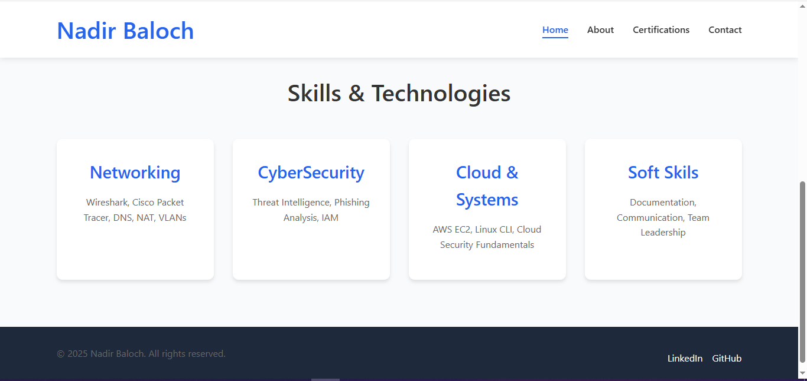
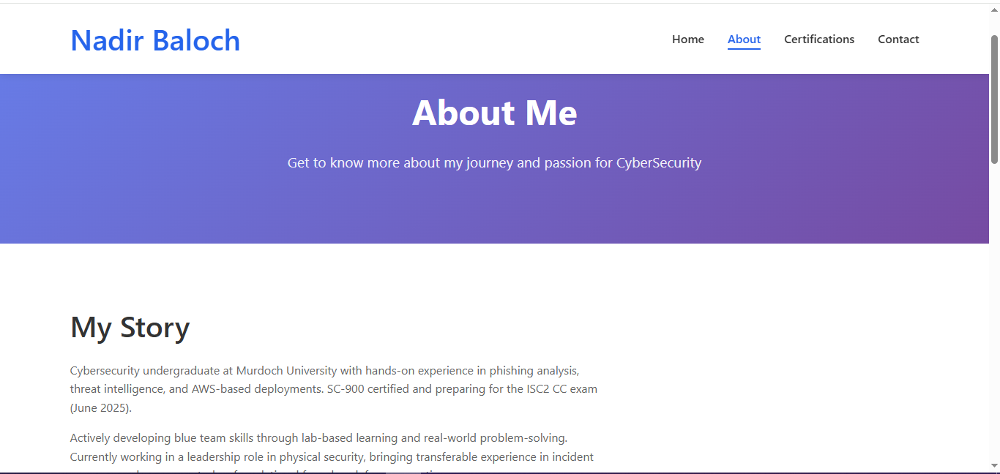
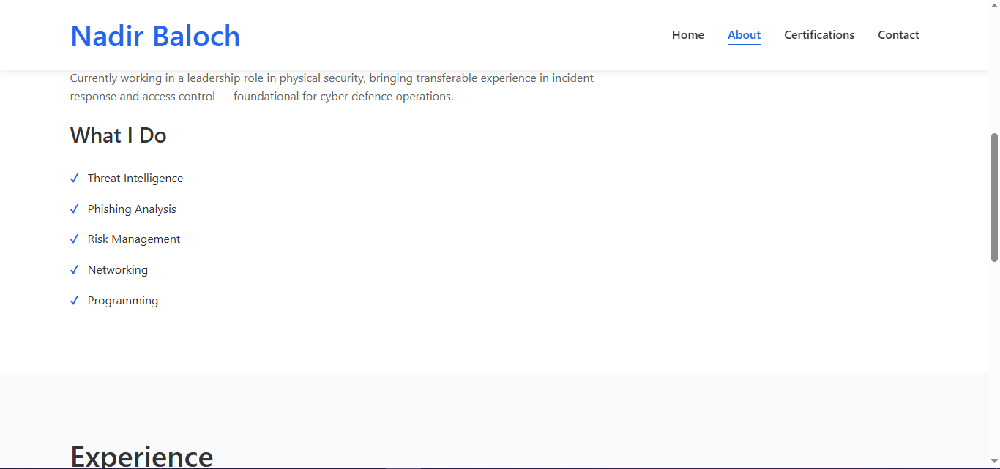
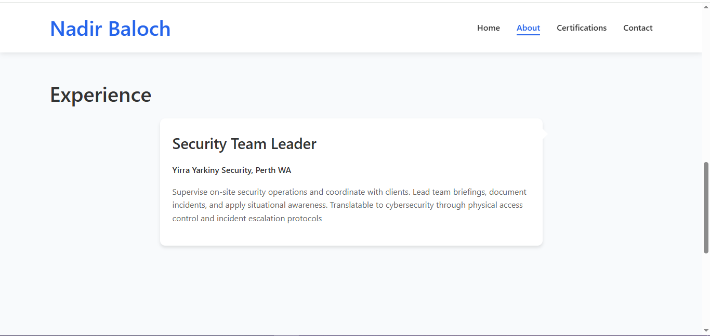
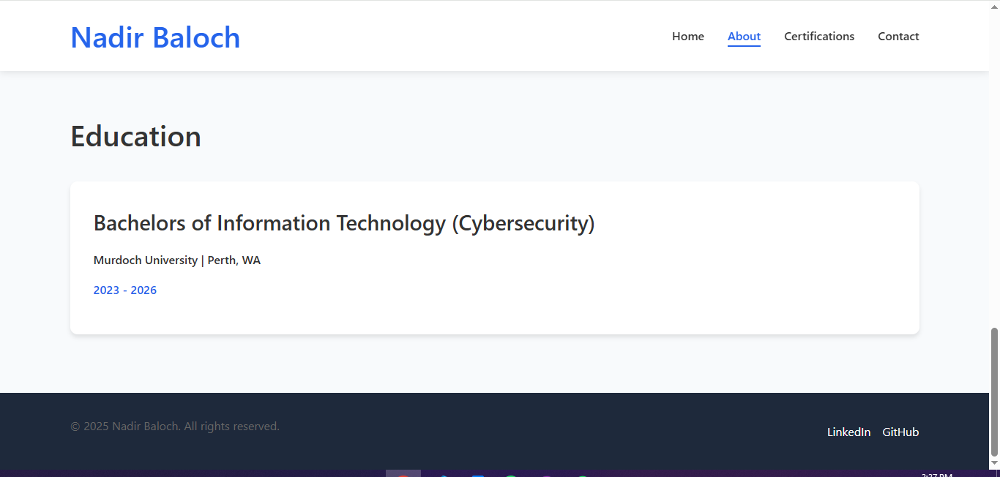
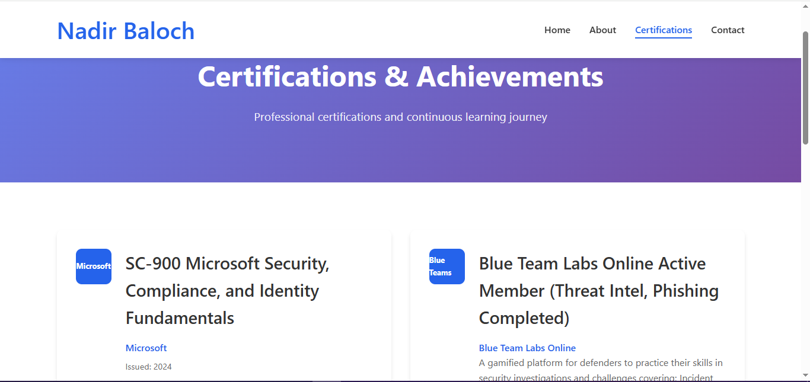
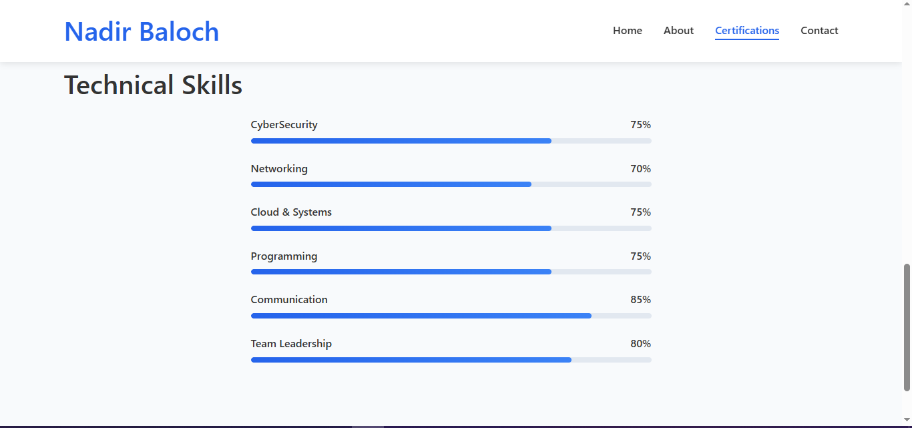

# Personal Portfolio Website

This is my  personal portfolio website built with HTML and CSS. This project showcases my  skills, certifications and provides a contact form for potential clients or employers.

The portfolio website can be accessed at www.nadirbaloch.com


## Table of Contents

- [Overview](#overview)
- [File Structure](#file-structure)
- [Pages](#pages)
  - [Home Page](#home-page)
  - [About Page](#about-page)
  - [Certifications Page](#certifications-page)
  - [Contact Page](#contact-page)
- [Styling](#styling)


## Overview

This portfolio website is designed to showcase my professional profile in a clean and modern layout. Built with pure HTML and CSS, it features multiple pages for different sections of content, a responsive design that works on all devices, and a contact form ready for EmailJS integration.

## File Structure

```
portfolio/
│
├── index.html              # Home page
├── about.html              # About page
├── certifications.html     # Certifications and skills page
├── contact.html            # Contact form page
└── styles.css              # Main stylesheet
```

## Pages

### Home Page

**File: `index.html`**

The home page serves as the landing page for the portfolio and includes:

- **Navigation Bar**: Fixed at the top with links to all pages
- **Hero Section**: Introduction with name, title, and call-to-action buttons
- **Skills & Technologies Section**: Overview of technical skills organized in cards
- **Footer**: Copyright information and social media links




### About Page

**File: `about.html`**

The about page provides detailed information about my background and includes:

- **Skils**: What I do
- **Experience Timeline**: Visual timeline of work history with descriptions
- **Education**: Academic background 








### Certifications Page

**File: `certifications.html`**

The certifications page highlights my professional credentials and skills:

- **Certification Cards**: Professional certifications with:
  - Certification name and issuing organization
  - Issue date
  - Description of skills validated
- **Skills Progress Bars**: Visual representation of skill proficiency levels

The page uses a card-based layout for certifications and visual progress bars to represent skill levels.




### Contact Page

**File: `contact.html`**

The contact page provides a way to get in touch and includes:

- **Contact Information**: Email, phone, location, and social profiles
- **Comprehensive Contact Form**: I've Added EmailJS integration with:
  - Personal information fields (name, email)
  - Message area

The contact form is designed to collect all necessary information for potential  inquiries.


## Styling

**File: `styles.css`**

The CSS file contains all styling for the portfolio website and is organized into sections:

- **Reset and Base Styles**: Normalizes browser defaults and sets base typography
- **Layout Components**: Container classes and grid systems
- **Navigation**: Styling for the responsive navbar
- **Buttons**: Various button styles and hover effects
- **Section-Specific Styles**: Custom styling for each major section
- **Form Elements**: Styling for inputs, selects, and form layout
- **Utility Classes**: Helper classes for common styling needs
- **Responsive Design**: Media queries for different screen sizes

### Color Scheme

The portfolio uses a clean color scheme centered around:
- Primary Blue: `#2563eb` (for buttons, links, and accents)
- Dark Text: `#333` (for headings and important text)
- Medium Text: `#666` (for body text)
- Light Background: `#f8fafc` (for alternating sections)
- White: `#fff` (for card backgrounds and main content areas)

